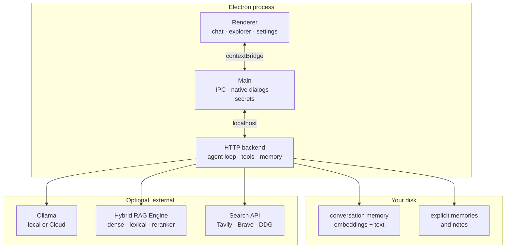

<div align="center">

# JARVIS

O cliente móvel está documentado em [docs/ANDROID_COMPANION.md](docs/ANDROID_COMPANION.md).

**An agentic development environment that runs on your machine.**

Local models through Ollama · tools that ask before they act · project RAG · memory that survives across conversations.

[](https://electronjs.org)
[](https://nodejs.org)
[](https://ollama.com)
[](https://github.com/fareloj/jarvis-ide/actions/workflows/ci.yml)
[](#development)
[]()
[](LICENSE)

</div>

---

<!-- SCREENSHOT: main chat window, with a reply and tool cards below it -->
<p align="center"></p>

## What it is

JARVIS is a desktop IDE built around an AI agent that stays on your machine. It talks to models
through **Ollama** — local or Cloud — reads your project, searches the web, runs commands, and
remembers what you told it in other conversations.

It is not a wrapper around a hosted assistant. The backend runs inside the Electron process, the
memory lives in files on your disk, and every action that can change something asks you first.

### Why it exists

Most AI coding tools either send your project to someone else's server or forget everything the
moment you open a new chat. JARVIS is an attempt at the opposite: **your machine, your files, your
history** — with the agent's reach deliberately fenced in.

## Features

| | |
|---|---|
| 🧠 **Cross-chat memory** | Say "I play football on Sundays" in one chat and the agent recalls it in another. Turns are embedded and retrieved by semantic similarity, not keyword matching. |
| 🔐 **Approval-gated tools** | Reads happen freely; writes, terminal commands and agent delegation always stop and ask. The policy lives in the tool registry, not in a prompt. |
| 📚 **Project RAG** | Hybrid retrieval (dense + lexical + reranker) over the folder you opened, through the external Hybrid RAG Engine stack. |
| 🔎 **Web search** | Tavily, Brave or DuckDuckGo. Results reach the model as untrusted data, never as instructions. |
| 📎 **Files and images** | Attach source files or screenshots to a message; images go to vision-capable models natively. |
| 🗂️ **File explorer and viewer** | Lazy-loaded tree, syntax highlighting, image preview, tabs. |
| 🤝 **Delegation** | Hand a heavy task to Claude Code, Codex or Antigravity CLI running headless in your project folder. |
| 📊 **Ollama Cloud quota** | Session and weekly usage synced from your account, with warnings before you hit the wall. |
| 🧩 **Skills** | Markdown instruction files (`SKILL.md`) toggled per conversation. Same shape Claude Code uses. |

> The interface is in **Brazilian Portuguese**. Everything else — code, config, this document — is in English.

## Architecture

The backend is **not** a separate service. It starts inside the Electron main process on a random
localhost port, so a single command brings up the whole app.



## Requirements

- **Node.js 20+** and **npm**
- **[Ollama](https://ollama.com)** running locally — it also acts as the gateway to Ollama Cloud
- *Optional* — the **[Hybrid RAG Engine](https://github.com/fareloj/hybrid-rag-engine)** Docker stack, for project RAG and cross-chat memory.
  Without it the chat works normally; it just stops recalling other conversations.

## Quick start

```bash
git clone https://github.com/fareloj/jarvis-ide.git
cd jarvis-ide/app
npm install
cp .env.example .env    # optional, the defaults already work
npm start
```

On Windows you can double-click **`iniciar-jarvis.bat`**, which checks Node, installs missing
dependencies, reports whether the memory service is up, and launches the app.

## Configuration

Everything is optional — the defaults assume Ollama on `127.0.0.1:11434`. See
[`app/.env.example`](app/.env.example) for the full list.

| Variable | What it does |
|---|---|
| `JARVIS_OLLAMA_HOST` | Ollama endpoint. Local process by default. |
| `JARVIS_OLLAMA_MODEL` | Default model for new conversations. |
| `JARVIS_TAVILY_API_KEY` | Web search built for LLM consumption. 1000 free credits/month. |
| `JARVIS_BRAVE_SEARCH_API_KEY` | Alternative search with its own index. |
| `JARVIS_EMBED_URL` | Embedding service backing cross-chat memory. |
| `JARVIS_CONVERSATION_MEMORY` | `0` disables cross-chat memory entirely. |

Search providers are picked automatically in order of quality: **Tavily → Brave → DuckDuckGo**.

## The agent's tools

Reads run automatically. Anything that writes, executes or spends money stops and waits for you.

| Tool | Risk | Approval |
|---|---|---|
| `rag_search` | read | never |
| `web_search` | network | never |
| `project_list_files` | read | never |
| `project_read_file` | read | never |
| `memory_list` | read | never |
| `memory_save` | write | **always** |
| `terminal_run` | execute | **always** |
| `delegate_coding_task` | execute | **always** |

File tools are confined to the folder you opened — a path escaping it throws before touching disk.

<!-- SCREENSHOT: tool approval card inside the chat -->
<p align="center"></p>

## Two kinds of memory

**Explicit** — the agent calls `memory_save` and you approve. Good for decisions and requirements.
Scoped per project, stored as JSON.

**Semantic (cross-chat)** — every meaningful turn is embedded and stored. Before each answer, the
turns most similar to your current message are pulled from *other* conversations and added to the
prompt. This is what lets the agent remember something you mentioned days ago in a different chat.

A few deliberate choices behind it:

- **Queries carry an instruction prefix.** Qwen3-Embedding is trained asymmetrically. Measured on
  the same pairs, without the prefix the scores of related and unrelated turns *overlap*, so no
  threshold works. With it they separate cleanly.
- **Credentials are redacted before writing.** An API key pasted in passing must not become a
  permanent record that resurfaces later.
- **Recalled text is labelled as transcript, not instruction.** It enters as a system message, so
  without that framing a prompt injection saved in one chat could come back with system authority
  days later.
- **The current conversation is excluded** from its own recall — it is already in the context.

Deleting a conversation deletes its memory too, across every project scope it touched. The
confirmation dialog says so explicitly.

<!-- SCREENSHOT: settings, with the memory toggle -->
<p align="center"></p>

## Skills

Skills are Markdown files with frontmatter, loaded from `app/skills/<id>/SKILL.md`:

```markdown
---
id: systematic-debugger
name: Systematic debugger
description: Isolates root cause instead of guessing.
---
When a bug persists, form hypotheses and bisect...
```

They are toggled per conversation in Settings and injected as system context while active.
The repo ships with 27, most imported from [tiagopgr/skills-ia](https://github.com/tiagopgr/skills-ia).

## Security

This app runs an AI agent with file and shell access, so the boundaries are the design:

- **Content Security Policy** on the renderer. `script-src 'self'` means HTML injected through file
  content cannot become executable script.
- **Context isolation and sandbox** on, `nodeIntegration` off. The renderer reaches the system only
  through an explicit `contextBridge` surface.
- **Untrusted data is framed as data.** Web results, file contents, RAG passages and recalled turns
  all carry instructions telling the model to treat them as evidence, never as commands.
- **Secrets.** The Ollama session cookie is encrypted with Electron `safeStorage`. Chat transcripts
  and API keys are gitignored.

Found something? Open an issue.

## Development

```bash
npm run check   # syntax check across main, preload, backend and renderer
npm test        # 60 tests, no external services required
npm start       # run the app
```

Tests use only the Node built-in runner — no framework, no mocking library. Anything that reaches
the network is stubbed, so the suite runs offline.

CI runs both commands on `windows-latest` with Node 20 from a clean `npm ci`, on every push and pull
request. See [CONTRIBUTING.md](CONTRIBUTING.md) for what a change has to satisfy, and
[SECURITY.md](SECURITY.md) for the threat model.

## Project structure

```
app/
├── backend/            # agent loop, tools, memory, search, quota
├── electron/           # main process, preload bridge
├── src/                # renderer: chat, explorer, settings
├── skills/             # SKILL.md instruction files
├── data/               # local memory and notes (gitignored)
└── iniciar-jarvis.bat  # Windows launcher
```

## Status

Early development (`v0.1.0`). It works and gets daily use, but interfaces change without notice and
there is no packaged release yet.

## License

[MIT](LICENSE) — do what you want, just keep the copyright notice.

The bundled skills under `app/skills/` come from two places: five are part of this project, and the
rest were imported from [tiagopgr/skills-ia](https://github.com/tiagopgr/skills-ia). See
[`app/skills/README.md`](app/skills/README.md) for their provenance.

---

<div align="center">
<sub>Built with Electron, Ollama and a lot of approval dialogs.</sub>
</div>
